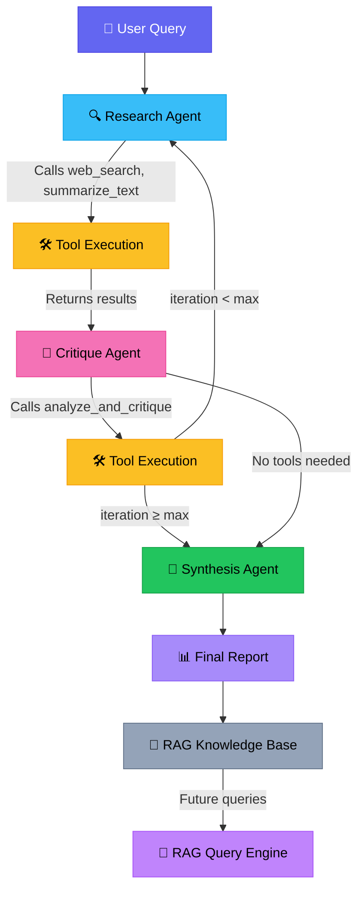

<p align="center">
  
  
  
  
  
</p>

<h1 align="center">🔬 Multi-Agent Research Assistant</h1>

<p align="center">
  <strong>A production-grade, agentic research system that autonomously searches, critiques, and synthesizes comprehensive research reports — powered by LangGraph, Google Gemini, and RAG.</strong>
</p>

---

## Overview

The **Multi-Agent Research Assistant** is an AI-powered research pipeline that coordinates multiple specialized agents to produce high-quality, fact-checked research reports. Unlike single-prompt LLM approaches, this system uses a **multi-agent graph architecture** where each agent has a distinct role — searching, critiquing, and synthesizing — creating an iterative refinement loop that significantly improves output accuracy.

The system also includes a **RAG (Retrieval-Augmented Generation) knowledge base** that stores and retrieves past research, enabling contextual follow-up queries with source citations.

---

## Architecture & Workflow



### Agent Roles

| Agent | Role | Tools Used |
|-------|------|------------|
| **🔍 Research Agent** | Searches the web for comprehensive, multi-angle information on the given topic | `web_search`, `summarize_text` |
| **🧪 Critique Agent** | Fact-checks findings, flags unverified claims, identifies bias and contradictions | `analyze_and_critique` |
| **📝 Synthesis Agent** | Compiles all verified research into a structured, cited report | Direct LLM (no tools) |
| **🤖 RAG Engine** | Stores research in a vector database for future retrieval with citation-aware answers | ChromaDB + Gemini Embeddings |

### How It Works

1. **User submits a research query** via the Streamlit UI or REST API.
2. **Research Agent** performs multiple web searches using Tavily, gathering information from diverse angles and sources.
3. **Tool Execution Layer** (LangGraph `ToolNode`) executes search and summarization tools, returning structured results.
4. **Critique Agent** reviews all gathered data — flagging unsupported claims, checking for contradictions, and identifying gaps.
5. **Iterative Refinement** — if the maximum iteration count hasn't been reached, the pipeline loops back to the Research Agent for additional searches on identified gaps.
6. **Synthesis Agent** compiles the verified, critiqued research into a professional report with executive summary, key findings, analysis, citations, and recommendations.
7. **RAG Ingestion** — research results are stored in ChromaDB, enabling future follow-up queries against a growing knowledge base.

---

## Key Features

- **🔄 Iterative Multi-Agent Pipeline** — Research → Critique → Refine → Synthesize loop with configurable iterations
- **🛡️ Anti-Hallucination Guardrails** — Strict grounding rules, source attribution, and fabrication detection at every stage
- **📚 RAG Knowledge Base** — Persistent vector storage (ChromaDB) with Gemini embeddings for contextual retrieval
- **📎 Citation-Aware Answers** — Every factual claim is attributed to its source URL
- **🌐 Real-Time Web Search** — Tavily advanced search with up to 7 results per query
- **🎨 Premium UI** — Glassmorphism design, dark/light mode, animated backgrounds, responsive layout
- **⚡ REST API** — Full FastAPI backend with endpoints for research, RAG queries, ingestion, and management
- **🔁 Rate Limit Handling** — Automatic exponential backoff retry on API rate limits

---

## Tech Stack

| Component | Technology |
|-----------|-----------|
| **Agent Orchestration** | [LangGraph](https://github.com/langchain-ai/langgraph) (StateGraph) |
| **LLM** | [Google Gemini 2.0 Flash](https://ai.google.dev/) (temperature: 0.1) |
| **Web Search** | [Tavily API](https://tavily.com/) (advanced depth, 7 results) |
| **Embeddings** | Gemini Embedding 001 |
| **Vector Store** | [ChromaDB](https://www.trychroma.com/) (persistent, local) |
| **Frontend** | [Streamlit](https://streamlit.io/) (custom CSS, glassmorphism UI) |
| **Backend API** | [FastAPI](https://fastapi.tiangolo.com/) + Uvicorn |
| **Framework** | [LangChain](https://www.langchain.com/) (tools, messages, splitters) |

---

## Project Structure

```
├── agents/
│   ├── __init__.py
│   └── research_graph.py      # Multi-agent graph: Research → Critique → Synthesis
├── rag/
│   ├── __init__.py
│   ├── rag_engine.py           # RAG pipeline: ingestion, retrieval, query
│   └── chroma_db/              # Persistent vector store data
├── app.py                      # Streamlit frontend (premium UI)
├── api.py                      # FastAPI REST API
├── test_setup.py               # Environment & dependency verification
├── requirements.txt            # Python dependencies
├── .env                        # API keys (not tracked in git)
└── README.md
```

---

## Getting Started

### Prerequisites

- Python 3.10 or higher
- [Google Gemini API Key](https://aistudio.google.com/apikey)
- [Tavily API Key](https://tavily.com/)

### Installation

1. **Clone the repository**
   ```bash
   git clone https://github.com/abhishekdev-ap/Reserch-AI-Agent.git
   cd Reserch-AI-Agent
   ```

2. **Create and activate a virtual environment**
   ```bash
   python -m venv .venv
   source .venv/bin/activate        # macOS/Linux
   .venv\Scripts\activate           # Windows
   ```

3. **Install dependencies**
   ```bash
   pip install -r requirements.txt
   ```

4. **Configure environment variables**
   ```bash
   # Create .env file in the project root
   echo "GEMINI_API_KEY=your_gemini_api_key_here" > .env
   echo "TAVILY_API_KEY=your_tavily_api_key_here" >> .env
   ```

5. **Verify setup**
   ```bash
   python test_setup.py
   ```

### Running the Application

**Streamlit UI** (recommended):
```bash
streamlit run app.py
```

**FastAPI Backend** (API-only):
```bash
python api.py
# or
uvicorn api:app --host 0.0.0.0 --port 8000 --reload
```

---

## API Endpoints

| Method | Endpoint | Description |
|--------|----------|-------------|
| `GET` | `/health` | Service health check |
| `POST` | `/research` | Run the full multi-agent research pipeline |
| `POST` | `/rag/query` | Query the RAG knowledge base with citations |
| `POST` | `/rag/ingest` | Ingest custom text into the knowledge base |
| `GET` | `/rag/stats` | Get vector store collection statistics |
| `DELETE` | `/rag/clear` | Clear the entire knowledge base |

### Example API Request

```bash
curl -X POST http://localhost:8000/research \
  -H "Content-Type: application/json" \
  -d '{"query": "Latest advances in quantum computing 2025", "max_iterations": 2}'
```

---

## Screenshots

The application features a premium dark-mode UI with glassmorphism effects, animated backgrounds, and a responsive layout:

- **Research Tab** — Enter queries, configure iterations, view real-time progress
- **RAG Knowledge Base Tab** — Query stored research with citation-aware answers
- **Ingest Tab** — Add custom documents to the knowledge base

---

## Anti-Hallucination Design

This system implements multiple layers of hallucination prevention:

1. **Low Temperature (0.1)** — Reduces creative/random outputs from the LLM
2. **Strict Grounding Prompts** — Every agent is instructed to only use provided data
3. **Source Attribution** — All claims must reference a source URL
4. **Critique Agent** — Dedicated agent that flags unverified or fabricated claims
5. **RAG Relevance Filtering** — Low-relevance documents (score < 0.3) are filtered out
6. **Iterative Verification** — Multiple passes through Research → Critique ensure accuracy

---

## License

This project is licensed under the MIT License. See [LICENSE](LICENSE) for details.

---

<p align="center">
  <sub>Built with ❤️ by <a href="https://github.com/abhishekdev-ap">Abhishek Dev</a></sub>
</p>
