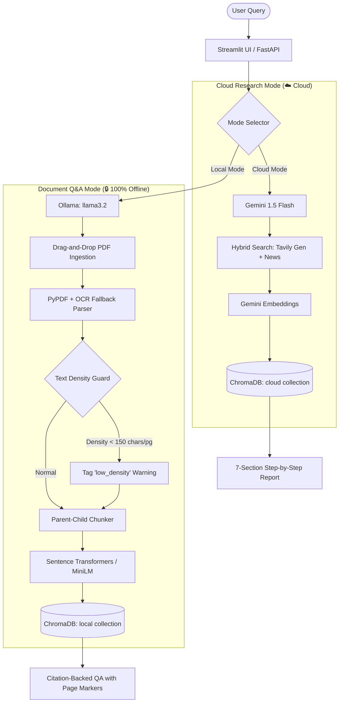

# 🔬 Multi-Agent Research Assistant & Offline RAG Engine

A production-grade, autonomous research system powered by **LangGraph**, **FastAPI**, and **Streamlit**. It orchestrates specialized AI agents to search, analyze, critique, and compile comprehensive, citation-aware research reports.

The system features a **Dual-Mode Execution Engine**—allowing you to run **Cloud Mode** (using Google Gemini, Tavily Search, and Google Embeddings) for advanced web-scale queries, or a dedicated, 100% offline **Document Q&A Mode** (using Ollama `llama3.2`, HuggingFace embeddings, and ChromaDB) for private document analysis.

---

## 🌐 Dynamic Dual-Mode Architecture

The system features a hot-swappable proxy structure. You can switch between modes instantly via the UI without restarting servers or editing configurations:



---

## 🧠 Core Architectural Breakdown

The application is structured into two highly optimized workflows depending on your environment needs:

### 1. Cloud Research Mode (Stateful LangGraph Loop)
* **🔍 Search & Research Agent**: Formulates targeted queries, executes parallel web searches, and extracts source URLs.
* **🧠 Critique & Fact-Checking Agent**: Evaluates gathered findings, checks figures across sources (e.g. NSE/BSE listings vs. news articles), and flags outdated data or inconsistencies.
* **📝 Synthesis & Report Agent**: Compiles verified summaries into a comprehensive step-by-step report.
* **⚡ Hybrid Search & Core-Relevance Filtering**: Real-time financial/ticker searches (e.g. share prices) run parallel week-scoped news and general searches, filtering out market noise by matching core query keywords.
* **📋 7-Section Structured Reports**: Reports follow a strict step-by-step layout:
  1. *Introduction and Background* (at least two detailed paragraphs)
  2. *Data Collection and Sources* (verified URLs and timestamps)
  3. *Key Findings* (live values, absolute metrics, structured lists)
  4. *Detailed Analysis* (multi-paragraph comparisons and reasoning)
  5. *Supporting Evidence* (empirical statistics)
  6. *Risks and Limitations* (explicitly categorizing findings into **Confirmed Facts**, **Estimates & Projections**, and **Opinions & Sentiments**)
  7. *Conclusion and Recommendations*

### 2. Document Q&A Mode (Offline-First Local RAG Console)
* **📄 Multi-Stage PDF Ingestion with OCR Fallback**: Extracts page text dynamically. If standard extraction returns blank or sparse text, it executes a high-resolution OCR fallback (`pdf2image` + `pytesseract`) page-by-page.
* **🛡️ Text Density Guard**: Automatically checks character-to-page density. If the document yields `< 150` characters per page on average (indicative of handwriting or flat image scans), the system tags it in the database and throws warning banners (`⚠️ Scanned/Handwritten (Low Accuracy)`) in the UI to prevent silent retrieval failures.
* **🧩 Parent-Child Chunking**: Embeds smaller **Child Chunks** (200 characters) to ensure precise semantic matching during vector searches, but retrieves and sends the corresponding larger **Parent Chunks** (1000 characters) to the LLM to preserve narrative flow and surrounding context.
* **🔍 Multi-Query Expansion**: Uses the local LLM to rewrite user questions into 3 distinct variations, performing parallel similarity queries to optimize recall.
* **📏 Distance-to-Similarity Calibration**: Converts ChromaDB's default squared L2 distance metrics to a proper `0.0 - 1.0` cosine-like similarity score: `similarity = max(0.0, 1.0 - distance / 2.0)`.
* **⚖️ Custom Hybrid Re-ranking Layer**: Reranks vector retrieval candidate blocks using exact phrase matches, term proximity windows, and keyword density matching (TF-IDF approximation).
* **🧠 Self-RAG Fact-Checking Loop**: Intercepts the generated answer draft and evaluates it against the raw document context using a temperature-0.0 factual checker agent. If claims are unsupported, it triggers a refinement loop to rewrite the answer.
* **🎯 Calibrated Confidence Scoring**: Uses scaled vector similarity and re-ranking metrics combined with keyword coverage and factuality outputs to display intuitive, realistic confidence ratings (e.g. `High (95%)`).
* **⚙️ RAG Pipeline Debugger Dashboard**: Embeds a collapsible developer panel under each assistant bubble showing collection names, scores, pages retrieved, context token counts, prompt lengths, and models used.

---

## 🛠️ Technology Stack & Rationale

We selected a hybrid, high-efficiency stack designed to optimize performance, minimize latency, and ensure strict privacy configurations when running offline:

| Component | Cloud Mode (Research) | Local Mode (Document Q&A) | Rationale & Selection Criteria |
|---|---|---|---|
| **Core LLM** | Google Gemini API (`gemini-1.5-flash`) | Ollama (`llama3.2` running locally) | **Cloud**: Gemini provides state-of-the-art multi-modal capabilities, rapid speed, and structured output parsing.<br>**Local**: Ollama runs models locally on commodity hardware, ensuring zero external data leakage. |
| **Web Search** | Tavily Search API (Hybrid News & Gen) | None (100% Offline Document Scoped) | **Cloud**: Tavily is built specifically for AI agents, returning pre-filtered, structured web content instead of raw HTML.<br>**Local**: Strict offline design halts all outbound network calls for high-security environments. |
| **Embeddings** | Google Generative AI Embeddings | `sentence-transformers/all-MiniLM-L6-v2` (Local CPU) | **Cloud**: High-dimensionality vector embeddings matched directly to Gemini's vocabulary.<br>**Local**: Lightweight, CPU-friendly semantic encoder requiring no GPU. |
| **Vector DB** | ChromaDB (`chroma_db/cloud`) | ChromaDB (`chroma_db/local` isolated folder) | **Both**: ChromaDB is a lightweight, developer-friendly vector database. We use isolated directory paths to ensure data separation. |
| **Orchestration** | LangGraph & LangChain | LangChain & PyPDF Parser | **Cloud**: LangGraph manages the stateful agent loops, fact-checking, and critiquing graphs.<br>**Local**: LangChain standardizes chains and prompts. |
| **OCR Fallback** | None | Poppler (`pdf2image`) & Tesseract (`pytesseract`) | **Local**: Automatically triggers high-fidelity OCR if standard PDF extraction fails, ensuring readability of legacy documents. |
| **Backend** | FastAPI & Uvicorn | FastAPI & Uvicorn | **Both**: Async web framework that serves fast JSON APIs and auto-generates interactive OpenAPI documentation. |
| **Frontend** | Streamlit (Ultra-Premium Dark/Light UI) | Streamlit (Ultra-Premium Dark/Light UI) | **Both**: Rapid frontend application creation with native reactivity, coupled with custom glassmorphism styling. |

---

## 🚀 Setup & Installation

### 1. Prerequisites
* **Python 3.10+** (Python 3.14 compatible)
* **Ollama** installed on your machine for offline operation.
  1. Download Ollama from [ollama.com](https://ollama.com).
  2. Pull the model:
     ```bash
     ollama pull llama3.2
     ```
  3. Verify Ollama is running (`ollama list`).
* **Tesseract & Poppler** (required for OCR Fallback on scanned documents):
  - macOS: `brew install tesseract poppler`
  - Linux: `sudo apt-get install tesseract-ocr poppler-utils`

### 2. Installation Steps

1. **Clone the Repository**:
   ```bash
   git clone https://github.com/abhishekdev-ap/Reserch-AI-Agent.git
   cd "Multi Agent research agent"
   ```

2. **Set Up Virtual Environment**:
   ```bash
   python3 -m venv .venv
   source .venv/bin/activate
   ```

3. **Install Dependencies**:
   ```bash
   pip install --upgrade pip
   pip install -r requirements.txt
   ```

4. **Configure Environment Variables**:
   Create a `.env` file in the root directory:
   ```env
   # Mode Selection: "cloud" or "local"
   LLM_MODE=local

   # Cloud Credentials (required for Cloud Mode)
   GEMINI_API_KEY=your_gemini_api_key
   TAVILY_API_KEY=your_tavily_api_key
   GEMINI_MODEL=gemini-1.5-flash

   # Local Settings
   OLLAMA_MODEL=llama3.2
   OLLAMA_BASE_URL=http://localhost:11434
   ```

---

## ⚡ Running the Application

Both backend and frontend services must run in parallel:

### Step 1: Start the Backend API
The FastAPI backend serves the multi-agent graph endpoints and ingestion controllers:
```bash
python api.py
```
*API will listen at `http://localhost:8000`. OpenAPI docs are available at `http://localhost:8000/docs`.*

### Step 2: Start the Streamlit UI
Run the frontend dashboard in a separate terminal:
```bash
streamlit run app.py
```
*Dashboard will open at `http://localhost:8501`.*

---

## 📂 Project Structure

```text
├── agents/
│   └── research_graph.py  # LangGraph research loops & fact-check nodes
├── rag/
│   ├── chroma_db/         # Dynamic database folder (isolated local vs cloud)
│   └── rag_engine.py      # PDF/OCR parser, ChromaDB client, and local Q&A pipeline
├── .env                   # Local credentials (git-ignored)
├── api.py                 # FastAPI backend entry point
├── app.py                 # Figma-inspired Streamlit dashboard UI
├── config.py              # Central dynamic mode, search & embedding resolver
├── requirements.txt       # Project dependencies
└── README.md              # Project documentation
```

---

## 🛡️ Security & Privacy
* **Strict Offline Mode**: Switching to Document Q&A Mode halts all web calls. Documents, embeddings, and query resolutions are kept entirely local.
* **Credential Protection**: The `.env` file and `chroma_db/` storage cache directories are blocked from version control via `.gitignore`.
